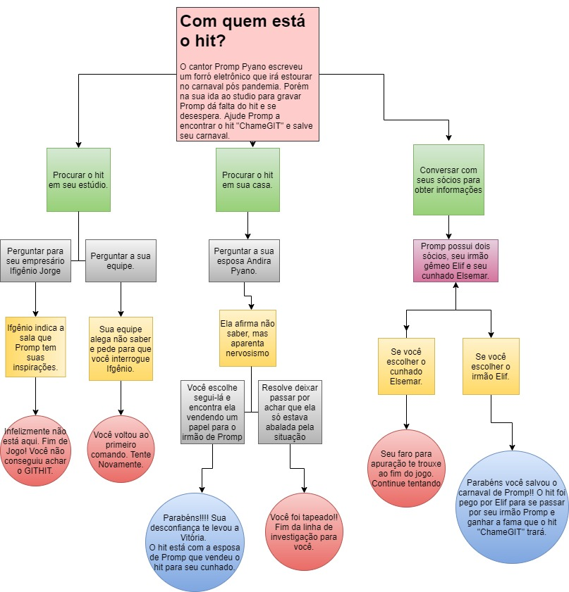

## Projeto Final Módulo 1
### __Tema__ : Investigação/Aventura
#### Nome : Juliana Simão 
>__Grupo__:
1. Isabela Oliveira
0. Jefferson Felix
5. Juliana Simão
1. Mateus Varelo
1. Mariãn do Carmo

# Onde está o ChameGIT?
#### O cantor Promp Pyano escreveu um forró eletrônico que irá estourar no carnaval pós pandemia. Porém na sua ida ao estudio para grava-lo,Promp dá falta do hit e se desespera. Ajude Promp a encontrar o hit "ChameGIT" e salve seu carnaval.

### O jogo faz aluções com nomes de condicionais usadas para escreve-lo e ao Python. 

> Listas dos personagens 
   
- Promp Pyano = Promp de Prompt e Pyano de Python
-------------------------------------
##### Cantor e personagem principal do jogo
----------------------------
- Andira Pyano = Andira de And e Pyano de Python
---------------------------
##### Esposa do cantor 
----------------------
- Ifgênio Jorge = Ifgênio de If  
-------------------------
##### Empresário de Promp 
--------------
- Elsemar = de condicionais Else 
---------------
##### Cunhado de Promp Pyano
----------------
- Elif Junior = Elif de Condicionais Elif 
##### Irmão de Promp Pyano
--------------

## Diagrama do Jogo

## Objetivo do Jogo
 A pessoa se torna o investigador do sumiço do hit e tem a opção de escolher os cenários que quer percorrer para encontrar quem o pegou.
  
> Dos 3 cenários, vá aonde seu faro investigativo te chame e ache o GITHIT :

- Procurar no estúdio
- Procurar na casa de Promp
- Conversar com seus sócios 

> Após as escolhas de cenário, o jogador tem mais duas opções de escolha, que consiste em perguntar aos personagens de dentro do cenário algumas pistas para concluir sua investigação ou fazer a escolha errada e perder o jogo. 

